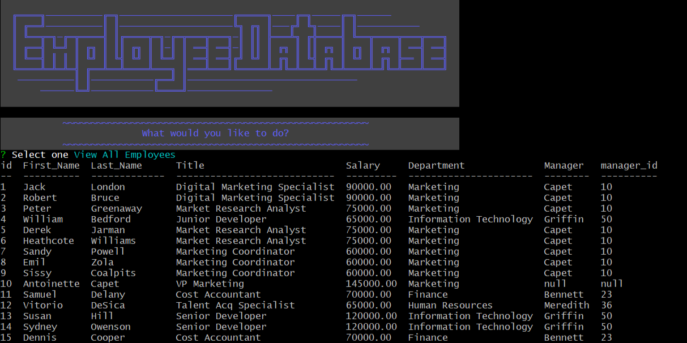

# Employee Tracker

Repo: https://github.com/chris-backes/employee-tracker

## Table of Contents

* [Description](#description)
    * [Database](#database)
    * [Application](#application)
* [Installation](#installation)
* [Usage](#usage)
    * [UI Features](#ui-features)
* [License](#license)
* [Author](#author)

## Description

Ths application was built from scratch as an interface with a MySQL database from the command line. The database itself is composed of three tables, and the database itself, the tables, and seed information can be populated from the command line or a MySQL interface like workbench.

A tutorial on the installation and use of this applicaiton can be found here: https://youtu.be/09TLNXxgVww

### Database

The database is composed of three tables, each storing different, related information.

#### Department

1. id
2. name

#### Role

1. id
2. title
3. salary
4. department_id

#### Employee

1. id
2. first_name
3. last_name
4. role_id
5. manager_id

### Application

The application is a composed of a user interface on the command line with a series of execute functions to perform on the database. These confists of viewing, adding, and deleting information storedi n the database. The information viewed is in some case an individual table, a concatenation of tables, or, in the case of the budget functions, a table displaying the result of funcitons performed on the information stored in the database.

## Installation

This requires the following software on your computer:

-   MySQL
-   Node
-   Bash or any CLI (to run the node and MySQL commands)
-   (Optional) A MySQL interface tool like Workbench

The application can be cloned from Github. Once on your local machine, from the command line, located at the root directory of the file, run `npm install`. This will download 5 packages and any of their dependencies:

1. mysql2
2. inquirer
3. console.table
4. cli-color

Once this is done, to create the database, and to populate it with tables, either A. log in to the mysql terminal on your CLI and run the commands: `source db/db.sql`, `source db/scema.sql`, and `source db/seeds.sql`, or B. execute thosefiles from within a MySQL interface like workbench.

## Usage

Once the applciation has been cloned, the packages installed, and the database set up, from the terminal (not mysql terminal), you can run `node index` to start the application.

The applicaiton will display a menu of options from which to select:
- View All Departments
- View All Roles
- View All Employees
- View All Employees by Manager
- View All Employees by Department
- Add a Department
- Add a Role
- Add an Employee
- Update Employee Role and/or Manager
- Delete Department
- Delete Role
- Delete Employee
- Get Budget
- Find Employee
- Get Budget, Head Count, and Average Salary
- Exit

Choosing any of this will initiate the attending funtion for that.

### UI Features

There has been limited engagment with a package to style the applciation with color with the cli-color package.

There is a sleep() function which pauses the process for 1 second, to avoid instances where the screen dumps information all at once.

There is a function to Exit the terminal, since the connection to the database is de facto left open.

## License 

This project is licensed under the Unlicense

## Contact

Christopher Backes 

Comments about bugs and and improvements should be directed to the issues of te repo on GitHub.

Github: [chris-backes](https://github.com/chris-backes/)
